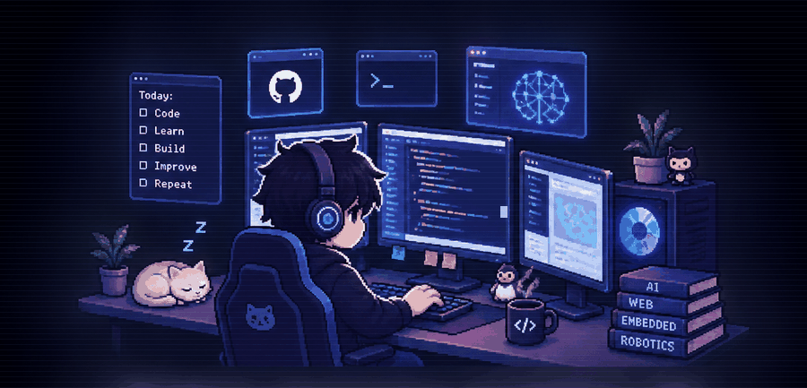
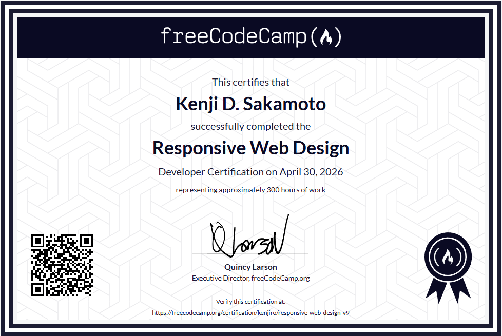
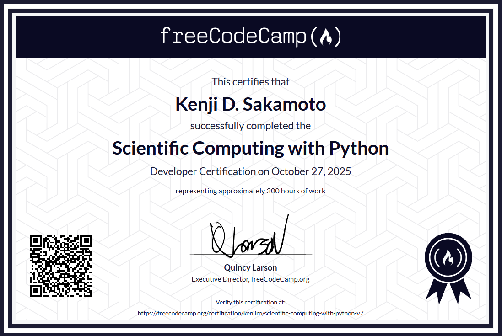
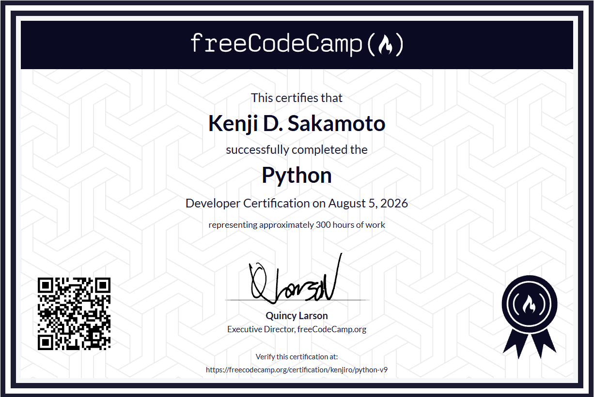

<!-- Animated Pixel-Art Coder -->

 

# KENJI D. SAKAMOTO

### Computer Engineering Student · AI · Software · Embedded Systems

Building practical systems where **software, AI, and hardware meet.**

 

&nbsp;

---

## About

I'm **Kenji D. Sakamoto**, a Computer Engineering student at **Universidad de Dagupan** interested in building practical systems that combine software, artificial intelligence, and hardware.

My work spans **AI, software engineering, embedded systems, IoT, and robotics**. I enjoy developing projects from the application layer all the way down to the hardware, including web applications, mobile applications, AI-powered tools, Raspberry Pi systems, microcontrollers, and robotics.

> **Learning by building. Building by experimenting.**

---

## Areas of Interest

<table>
<tr>
<td width="50%" valign="top">

### 🧠 Artificial Intelligence

* AI-powered applications
* Generative AI APIs
* AI-assisted workflows
* Intelligent automation
* Educational AI systems

</td>
<td width="50%" valign="top">

### 💻 Software Engineering

* Full-stack web development
* Mobile application development
* JavaScript, Python & Dart
* REST APIs
* Database-driven applications

</td>
</tr>

<tr>
<td width="50%" valign="top">

### 🔌 Embedded Systems

* Arduino
* ESP32
* Raspberry Pi
* Sensors & peripherals
* IoT systems

</td>
<td width="50%" valign="top">

### 🤖 Robotics

* Robot control systems
* Computer vision
* Motors & servos
* Hardware integration
* Prototyping

</td>
</tr>
</table>

---

## Certifications

### Scientific Computing with Python

  

### Responsive Web Design

  

### Python

I'm continuously building projects that connect these areas together, with the long-term goal of developing **intelligent, reliable, and practical technology systems.**

---

## Tech Stack

### Languages

  

### Frameworks & Development

  

### Databases

 

### Embedded & Hardware

---

### AI · Software · Embedded · Robotics

 

**Building. Learning. Experimenting.**

 

<a href="https://kenjisakamoto.me">kenjisakamoto.me</a>

